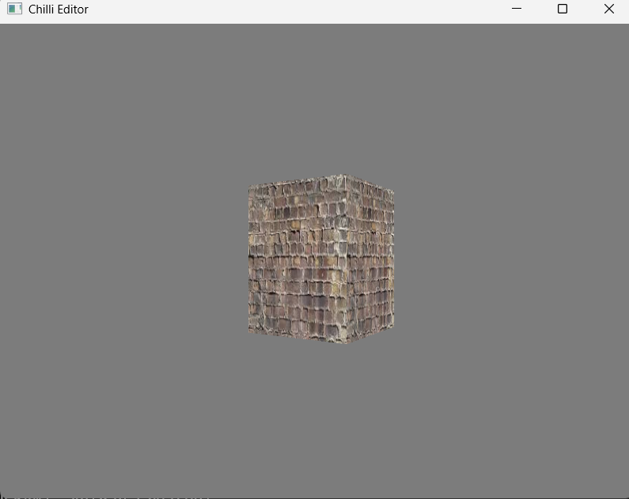

# Chilli Engine

A modern, cross-platform game engine built with Vulkan, featuring a modular architecture and extensible design.


## 🚀 Features

- **Cross-Platform Support**: Windows and Linux (with potential Android support in the future)
- **Modern Graphics API**: Vulkan 1.3 as the primary rendering backend
- **Modular Architecture**: Clean separation of core systems, rendering, and extensions
- **Bindless Rendering**: Efficient resource management with descriptor sets
- **Multi-Pass Rendering**: Advanced two-pass rendering system with geometry and screen passes
- **Extensible Layer System**: User-defined features through layer stacks
- **Comprehensive Resource Management**: Managed resources for meshes, textures, materials, and pipelines

## 📁 Project Structure
Chilli/
├── Libs/ # Third-party dependencies
│ ├── GLFW/ # Window management
│ ├── glm/ # Mathematics library
│ ├── SpdLog/ # Logging system
│ ├── SPIRV-Reflect/ # SPIR-V reflection
│ ├── Stb/ # Image loading
│ └── VMA/ # Vulkan Memory Allocator
└── Src/
├── Core/ # Engine core systems
│ ├── Application/
│ ├── Events/
│ ├── Input/
│ ├── Layers/
│ ├── Profiling/
│ ├── UUID/
│ └── Window/
└── Renderer/
└── Vulkan/ # Vulkan rendering backend

## 🏗️ Architecture

The engine follows a layered architecture:

- **Core Layer**: Foundation containing window management, input handling, events, mathematics, and profiling
- **Renderer Layer**: Vulkan-based rendering backend with bindless resource management
- **Application Layer**: Integrates all systems to create the main application
- **Extensions Layer**: (In development) User-extensible features through layer stacks

## 🎯 CMake Structure

- `CMakeLists.txt` (Main) - Builds the Chilli Editor application
- `ChilliLib` - Core engine library
- `ChilliVulkan` - Vulkan rendering backend
- `ChilliExtensions` - (In development) Extension system

## 🎨 Rendering System

### Two-Pass Render Pipeline

The engine implements a sophisticated two-pass rendering system:

```cpp
// 1. Geometry + ZBuffer Pass
Chilli::ColorAttachment ColorAttachment;
ColorAttachment.ClearColor = { 0.2f, 0.2f, 0.2f, 1.0f };
ColorAttachment.UseSwapChainImage = false;
ColorAttachment.ColorTexture = TextureManager.Get(GeometryPassColorTexture);

Chilli::DepthAttachment DepthAttachment;
DepthAttachment.DepthTexture = TextureManager.Get(GeometryPassDepthTexture);

// 2. Screen Quad Pass
Chilli::ColorAttachment ScreenColorAttachment;
ScreenColorAttachment.ClearColor = { 0.2f, 0.2f, 0.2f, 1.0f };
ScreenColorAttachment.UseSwapChainImage = true;
```

## Bindless Descriptor Sets

The engine uses 5 bindless descriptor sets for efficient resource management:

- `GLOBAL` -  Global scene data and camera information
- `SCENE` - Scene-specific uniform data
- `TEX_SAMPLERS` -Texture and sampler resources
- `MATERIALS` - Material properties and configurations
- `OBJECT` - Per-object transformation data

## Screenshots


## Core System

### Resource Management

```cpp
Chilli::MeshManager MeshManager;
Chilli::SamplerManager SamplerManager;
Chilli::TextureManager TextureManager;
Chilli::GraphicsPipelineManager ShaderManager;
Chilli::MaterialManager MaterialManager;
```

### Materials
```cpp
struct Material
{
    UUID ID;
    UUID UsingPipelineID;

    UUID AlbedoTexture;
    UUID AlbedoSampler;
    Vec4 AlbedoColor;
};
```

### Object
```cpp
struct Object
{
    UUID MeshIndex;
    UUID MaterialIndex;
    UUID ID;
    Transform Transform;
};
```
## Build Instructions

```
git clone https://github.com/Its-Anuj/Chilli.git
cd Chilli
mkdir build && cd build
cmake ..
cmake --build . --config Release
```

### 🔮 Future Plans
- `Metal Backend` -  Additional rendering backend for macOS/iOS
- `Android Support` -  Mobile platform expansion
- `Advanced Rendering` -  Ray tracing, global illumination
- `Editor Tools` -  Enhanced development environment
- `Asset Pipeline:` - Improved import/export capabilities
 -: 
