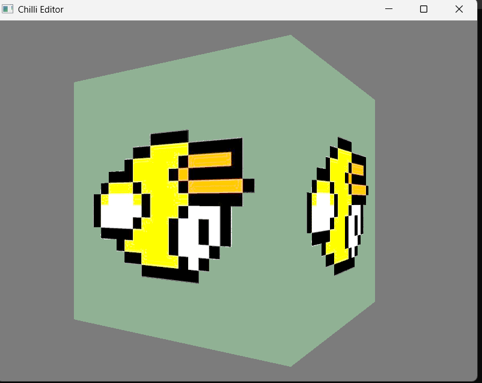
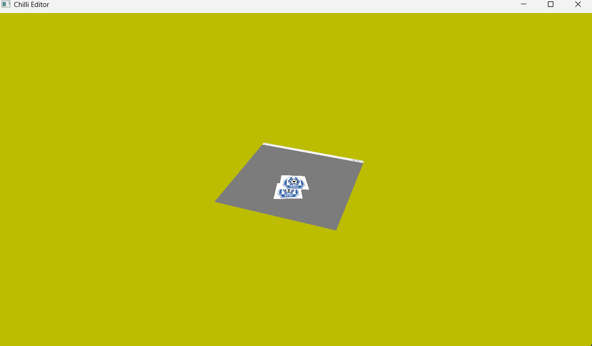
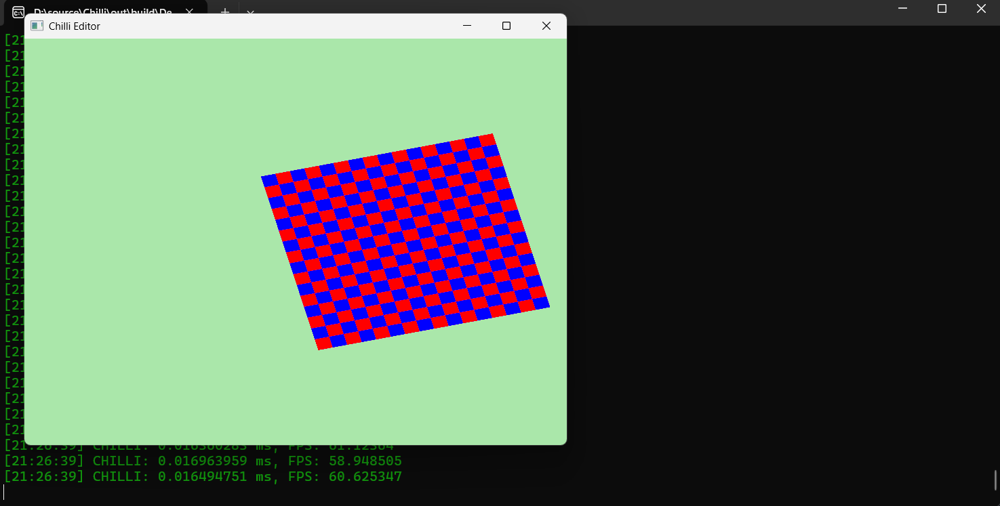

# Chilli

Chilli is a 3D game engine utilizing modern Vulkan 1.3 for rendering.

## Structure

### ChilliCore
Handles the foundational engine systems:
- **Windowing**: Creation and management of application windows (GLFW).
- **Input**: Keyboard, mouse, and controller input handling.
- **Events**: Event dispatching and processing.
- **Layers**: Layered architecture for modular engine features.
- **Applications**: Application lifecycle management.

### ChilliRenderAPI
Primarily Vulkan-based (for now), responsible for:
- **Rendering**: Command buffer management, frame rendering.
- **Resource Creation/Deletion**: Buffers, textures, pipelines, etc.
- **Synchronization**: Fences, semaphores, frame pacing.

### ChilliExtensions (Planned)
Future module to transform Chilli from a rendering engine into a full game engine:
- **Gameplay Systems**
- **Scripting**
- **Physics**
- **Audio**

## Dependencies

- [GLFW](https://www.glfw.org/) (Windowing & Input)
- [glm](https://github.com/g-truc/glm) (Math library)
- [Vulkan Memory Allocator (VMA)](https://github.com/GPUOpen-LibrariesAndSDKs/VulkanMemoryAllocator) (Efficient Vulkan memory management)
- [spdlog](https://github.com/gabime/spdlog) (Logging)
- [stbi](https://github.com/nothings/stb.git) (Image Loading)
- [SPIRV-Reflect](https://github.com/KhronosGroup/SPIRV-Reflect.git) (SPIRV code Reflection)

## Features 

## Attachments(NEW)

### 1. Color Attachment

On ColorAttachment.UseSwapChainTexture the RenderPass allows the attachment to render to the SwapChain Image

````````
		Chilli::ColorAttachment ColorAttachment{};
		ColorAttachment.UseSwapChainImage = true;
		ColorAttachment.ClearColor = { 0.2f, 0.2f, 0.2f, 1.0f };
````````

### 2. Depth Attachment

We have to provide a pre made Depth Texture

````````
		Chilli::DepthAttachment DepthAttachment{};
		DepthAttachment.TextureAttachment = DepthTexture;
````````

### 3. RenderPass(NEW)

Based on vulkan dynamic rendering info also allowing multiple color attachments and only a single depth attachment

````````
		Chilli::RenderPass RenderPass;
		RenderPass.ColorAttachmentCount = 1;
		RenderPass.ColorAttachments = &ColorAttachment;
		RenderPass.DepthAttachment = &DepthAttachment;
````````

### 4. Texture(NEW)

## a. Image Texture

````````
	Chilli::TextureSpec Spec{};
	Spec.FilePath = "flappy-bird.png";
	Spec.Tiling = Chilli::ImageTiling::IMAGE_TILING_OPTIOMAL;
	Spec.Type = Chilli::ImageType::IMAGE_TYPE_2D;
	Spec.Mode = Chilli::SamplerMode::REPEAT;
	Spec.Filter = Chilli::SamplerFilter::LINEAR;

	Texture = Chilli::Renderer::GetResourceFactory().CreateTexture(Spec);
		
````````

## b. Depth Texture

````````
			Chilli::TextureSpec Spec{};
			Spec.FilePath = nullptr;
			Spec.Tiling = Chilli::ImageTiling::IMAGE_TILING_OPTIOMAL;
			Spec.Type = Chilli::ImageType::IMAGE_TYPE_2D;
			Spec.Format = Chilli::ImageFormat::D24_S8;
			Spec.Resolution = { 800, 600 };
			Spec.Usage = Chilli::ImageUsage::DEPTH;

			DepthTexture = Chilli::Renderer::GetResourceFactory().CreateTexture(Spec);
````````

### 6. Material

## Creation
````````
			Chilli::Material Mat1;
			Mat1.SetShader(Shader);
			Mat1.SetUniformBuffer("GlobalUBO", GlobalUB);
			Mat1.SetUniformBuffer("ubo", BirdUBO);
			Mat1.SetTexture("Tex", Texture);

			Mat1.Update();
````````

Using to provide a Uniform Buffer

````````
		static float decrease = 0.0f;
		UBO ubo;
		ubo.Transform = glm::translate(glm::mat4(1.0f), BirdData.Position);
		ubo.Transform = glm::rotate(ubo.Transform, 45.0f, glm::vec3(0.0f, 1.0f, 0.0f));
		BirdUBO->MapData((void*)&ubo, sizeof(ubo));

		Chilli::Renderer::Submit(Mat1, VertexBuffer, IndexBuffer);
````````

### 5. New Features in New Renderer
- Better Api 
- Better Abstraction
- Better Resource Factory(Re think)
- Follow end level standard for the fundamentals of the Vulkan Renderer

## Example Code

### 1. Resource Creation: Vulkan Buffer

````````
			std::vector<Vertex> vertices;
			vertices.reserve(3);
			vertices.push_back(glm::vec3(0.0f, -0.5f, 0.0f));
			vertices.push_back(glm::vec3(0.5f, 0.5f, 0.0f));
			vertices.push_back(glm::vec3(-0.5f, 0.5f, 0.0f));

			Chilli::VertexBufferSpec Spec{};
			Spec.Data = vertices.data();
			Spec.Size = vertices.size() * sizeof(Vertex);
			Spec.Count = vertices.size();
			Spec.Type = Chilli::BufferType::STATIC_DRAW;

			VertexBuffer = Chilli::Renderer::GetResourceFactory()->CreateVertexBuffer(Spec);
````````

### 2. Render Loop

````````
		bool Continue = Chilli::Renderer::BeginFrame();
		if (!Continue)
			return;

		Chilli::ColorAttachment ColorAttachment{};
		ColorAttachment.UseSwapChainImage = true;
		ColorAttachment.ClearColor = { 0.2f, 0.2f, 0.2f, 1.0f };

		Chilli::DepthAttachment DepthAttachment{};
		DepthAttachment.TextureAttachment = DepthTexture;

		RenderPass.ColorAttachmentCount = 1;
		RenderPass.ColorAttachments = &ColorAttachment;
		RenderPass.DepthAttachment = &DepthAttachment;

		Chilli::Renderer::BeginRenderPass(RenderPass);

		static float decrease = 0.0f;
		UBO ubo;
		ubo.Transform = glm::translate(glm::mat4(1.0f), BirdData.Position);
		ubo.Transform = glm::rotate(ubo.Transform, 45.0f, glm::vec3(0.0f, 1.0f, 0.0f));
		BirdUBO->MapData((void*)&ubo, sizeof(ubo));

		Chilli::Renderer::Submit(Mat1, VertexBuffer, IndexBuffer);

		Chilli::Renderer::EndRenderPass();

		Chilli::Renderer::Render();
		Chilli::Renderer::Present();

		Chilli::Renderer::EndFrame();
````````

### 3. Resource Deletion

````````
		Chilli::Renderer::GetResourceFactory()->DestroyVertexBuffer(VertexBuffer);
````````

## Examples


## Screenshots

_Add screenshots of your application here!_



---

For more details, see the documentation and source code.
