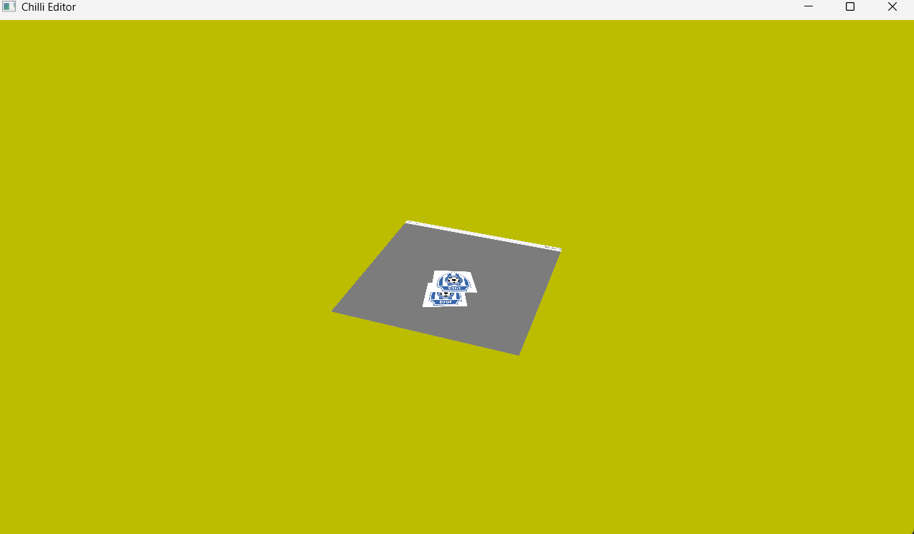
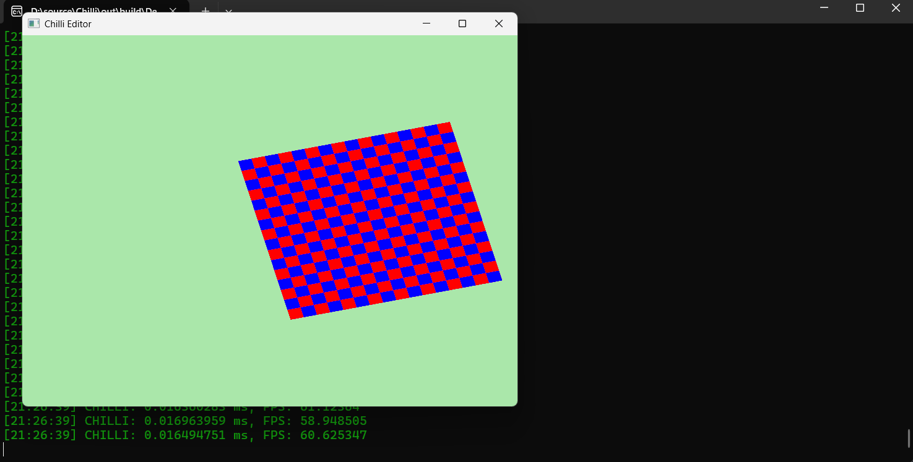

# Chilli

Chilli is a 3D game engine utilizing modern Vulkan 1.3 for rendering.

## Structure

### ChilliCore
Handles the foundational engine systems:
- **Windowing**: Creation and management of application windows (GLFW).
- **Input**: Keyboard, mouse, and controller input handling.
- **Events**: Event dispatching and processing.
- **Layers**: Layered architecture for modular engine features.
- **Applications**: Application lifecycle management.

### ChilliRenderAPI
Primarily Vulkan-based (for now), responsible for:
- **Rendering**: Command buffer management, frame rendering.
- **Resource Creation/Deletion**: Buffers, textures, pipelines, etc.
- **Synchronization**: Fences, semaphores, frame pacing.

### ChilliExtensions (Planned)
Future module to transform Chilli from a rendering engine into a full game engine:
- **Gameplay Systems**
- **Scripting**
- **Physics**
- **Audio**

## Dependencies

- [GLFW](https://www.glfw.org/) (Windowing & Input)
- [glm](https://github.com/g-truc/glm) (Math library)
- [Vulkan Memory Allocator (VMA)](https://github.com/GPUOpen-LibrariesAndSDKs/VulkanMemoryAllocator) (Efficient Vulkan memory management)
- [spdlog](https://github.com/gabime/spdlog) (Logging)
- [stbi](https://github.com/nothings/stb.git) (Image Loading)

## Features 

## Attachments(NEW)

### 1. Color Attachment

On ColorAttachment.UseSwapChainTexture the RenderPass allows the attachment to render to the SwapChain Image

````````
		Chilli::ColorAttachment ColorAttachment{};
		ColorAttachment.UseSwapChainTexture = true;
		ColorAttachment.ClearColor = { 0.4f, 0.8f, 0.4f, 1.0f };
````````

### 2. Depth Attachment

We have to provide a pre made Depth Texture

````````
		Chilli::DepthAttachment DepthAttachment{};
		DepthAttachment.DepthTexture = DepthTexture;
		DepthAttachment.Planes.Far = 1.0f;
		DepthAttachment.Planes.Near = 0;
		DepthAttachment.UseSwapChainTexture = false;
````````

### 3. RenderPass(NEW)

Based on vulkan dynamic rendering info also allowing multiple color attachments and only a single depth attachment

````````
		Chilli::BeginRenderPassInfo NormalPassInfo;
		NormalPassInfo.ColorAttachments = &ColorAttachment;
		NormalPassInfo.ColorAttachmentCount = 1;
		NormalPassInfo.DepthAttachment = DepthAttachment;
````````

### 4. Texture(NEW)

## a. Image Texture

````````
		Chilli::TextureSpec Spec{};
		Spec.FilePath = "A.png";
		Spec.Format = Chilli::ImageFormat::RGBA8;
		Spec.Tiling = Chilli::ImageTiling::IMAGE_TILING_OPTIONAL;
		Spec.Type = Chilli::ImageType::IMAGE_TYPE_2D;
		Spec.Aspect = Chilli::ImageAspect::COLOR;

		Texture = Chilli::Renderer::GetResourceFactory()->CreateTexture(Spec);
````````

## b. Depth Texture

````````
		Chilli::TextureSpec Spec{};
		Spec.Resolution.Width = Chilli::Renderer::GetFrameBufferSize().x;
		Spec.Resolution.Height = Chilli::Renderer::GetFrameBufferSize().y;
		Spec.Format = Chilli::ImageFormat::D32_FLOAT;
		Spec.Tiling = Chilli::ImageTiling::IMAGE_TILING_OPTIONAL;
		Spec.Type = Chilli::ImageType::IMAGE_TYPE_2D;
		Spec.ImageData = nullptr;
		Spec.FilePath = nullptr;
		Spec.Aspect = Chilli::ImageAspect::DEPTH;

		DepthTexture = Chilli::Renderer::GetResourceFactory()->CreateTexture(Spec);
````````

## c. Checkerboard Texture

````````
		Chilli::TextureSpec Spec{};

		Spec.Format = Chilli::ImageFormat::RGBA8;
		Spec.Tiling = Chilli::ImageTiling::IMAGE_TILING_OPTIONAL;
		Spec.Type = Chilli::ImageType::IMAGE_TYPE_2D;
		Spec.Resolution.Width = 800;
		Spec.Resolution.Height = 800;
		Spec.FilePath = nullptr;
		Spec.Aspect = Chilli::ImageAspect::COLOR;

		uint32_t* ImageData = new uint32_t[800 * 800];
		for (int y = 0; y < 800; y++)
		{
			for (int x = 0; x < 800; x++)
			{
				if ((x / 50 + y / 50) % 2 == 0) {
					ImageData[y * 800 + x] = 0xFFFF0000;
				}
				else {
					ImageData[y * 800 + x] = 0xFF0000FF;
				}
			}
		}

		Spec.ImageData = ImageData;

		WhiteTexture = Chilli::Renderer::GetResourceFactory()->CreateTexture(Spec);
		delete[] ImageData;
````````

### 5. New Features in New Renderer
- Better Api 
- Better Abstraction
- Better Resource Factory(Re think)
- Follow end level standard for the fundamentals of the Vulkan Renderer

## Example Code

### 1. Resource Creation: Vulkan Buffer

````````
			std::vector<Vertex> vertices;
			vertices.reserve(3);
			vertices.push_back(glm::vec3(0.0f, -0.5f, 0.0f));
			vertices.push_back(glm::vec3(0.5f, 0.5f, 0.0f));
			vertices.push_back(glm::vec3(-0.5f, 0.5f, 0.0f));

			Chilli::VertexBufferSpec Spec{};
			Spec.Data = vertices.data();
			Spec.Size = vertices.size() * sizeof(Vertex);
			Spec.Count = vertices.size();
			Spec.Type = Chilli::BufferType::STATIC_DRAW;

			VertexBuffer = Chilli::Renderer::GetResourceFactory()->CreateVertexBuffer(Spec);
````````

### 2. Render Loop

````````
		Chilli::Renderer::BeginFrame();

		Chilli::Renderer::BeginRenderPass();

		Chilli::Renderer::Submit(Shader, VertexBuffer, IndexBuffer);

		Chilli::Renderer::EndRenderPass();

		Chilli::Renderer::RenderFrame();
		Chilli::Renderer::Present();

		Chilli::Renderer::EndFrame();
````````

### 3. Resource Deletion

````````
		Chilli::Renderer::GetResourceFactory()->DestroyVertexBuffer(VertexBuffer);
````````

## Screenshots

_Add screenshots of your application here!_



---

For more details, see the documentation and source code.
